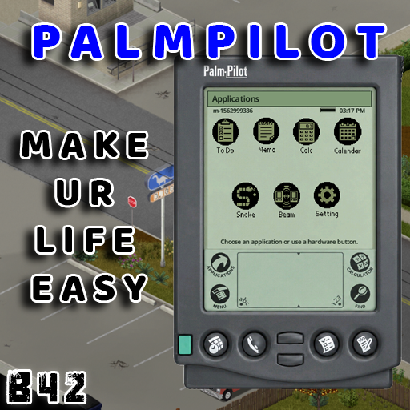

<div align="center">



# Palm Pilots

### A pocket-sized piece of 1998 for the end of the world.

Bring a fully functional handheld organizer into **Project Zomboid**—plan supply runs, write survivor notes, check the date, crunch numbers, play Snake or Chess, and beam data to nearby survivors.

[](https://projectzomboid.com/)
[](#)
[](#multiplayer--beam)
[](https://steamcommunity.com/sharedfiles/filedetails/?id=3776531193)

[Features](#features) · [Installation](#installation) · [Controls](#controls) · [Multiplayer](#multiplayer--beam)

</div>

---

> Knox Country has no app store, no cell service, and very few working luxuries. Fortunately, your PalmPilot doesn't need any of them.

## Features

| Get organized | Useful tools | Authentic survivor tech |
| :--- | :--- | :--- |
| ✅ Named task lists and checklist items | 🧮 Working calculator | 🔋 Removable batteries |
| 📝 Multi-line memos | 📅 Live in-game calendar | 🕹️ Playable Snake and Chess games |
| 🔎 Find and sort saved entries | 📡 Infrared Beam transfers | 🎒 Equipped-hand 3D model |
| 💾 Data saved per physical device | ⚙️ Nickname and privacy settings | 📦 Placeable world model |

Every PalmPilot has its **own identity, battery level, nickname, settings, tasks, memos, Snake high score, and Chess position**. Its data stays with the device when it is dropped, stored, traded, saved, or carried into another multiplayer session.

## Built-in applications

### To Do

Create named lists, add checklist items, mark jobs complete, and sort everything by name or creation date. It is perfect for loot routes, safehouse chores, and the ever-growing list of things that can kill you.

### Memo

Keep multi-line notes directly on the device: generator locations, radio frequencies, map coordinates, suspiciously specific final words—you decide.

### Calculator & Calendar

Use a functional calculator and check the current in-game date and time without breaking immersion.

### Snake

The classic time-waster, now available during the apocalypse. While you actively play, Snake slowly reduces your character's Boredom and Unhappiness (the stat behind Depression). In multiplayer, the server applies and syncs this benefit. Pausing, leaving the game, or running out of battery stops it. Your high score belongs to the device, so think twice before lending it out.

### Chess

Chess opens with **Continue solo game**, **New solo game**, and **New multiplayer game**. In the solo game, play White against a compact computer opponent. Tap a piece to highlight it and its legal destinations, then tap a destination. The computer pauses briefly before moving its piece across the board. Captured White pieces appear left of the board; captured Black pieces appear right. The game supports check and checkmate, castling, en passant, pawn promotion, stalemate, and the fifty-move draw rule. The solo position and captured pieces are saved on each physical PalmPilot, so you can close it and continue later. Older saved positions infer captured pieces from the board where possible.

For two-player Chess, both survivors need a powered PalmPilot in hand with Beam enabled. Choose **New multiplayer game**, select a player within **3 tiles on the same floor**, and wait for them to accept. The inviter plays White, and each player sees their own pieces at the bottom of the board. The server checks every move. Leaving, putting a PalmPilot away, losing power, or moving out of range disconnects the match. The remaining player sees a Disconnected screen with a button to start a new multiplayer game. Live matches do not overwrite either player's solo save and cannot be continued after disconnecting; **Continue solo game** opens only the saved computer game. Active Chess play slowly reduces Boredom and Unhappiness at the same rate as Snake; multiplayer applies the benefit on the server. The benefit stops after 30 seconds without a tap or when you leave Chess. This is an original in-mod game; the ChessGenius Palm OS `.prc` is not included or executed.

### Beam

Send one task list, one memo, or **Beam All** to copy everything to a nearby PalmPilot. Repeated transfers update previously received entries instead of filling the device with duplicates.

## Multiplayer & Beam

Beam transfers are server-authoritative and validated before any data changes hands.

1. Both survivors need a PalmPilot nearby on the **same floor**.
2. Open **Beam** and choose a device or player.
3. Select a task list, memo, or **Beam All**.
4. The receiving PalmPilot stores its own local copy.

Beam can be disabled in the device settings whenever a survivor wants a little post-apocalyptic privacy. Opening devices, synchronization, and transfers support Build 42.20's multiplayer inventory behavior.

## Finding a PalmPilot

PalmPilots are intentionally rare. Search places where late-1990s professionals and electronics are likely to have left them:

- Executive and ordinary office desks
- Electronics stores and electronics crates
- Pawnshop display cases
- Wealthy home offices
- Office-worker zombies, who visibly carry the device in one hand

Use the **Palm Pilots → PalmPilot Spawn Rate** sandbox setting to choose None, Very Rare, Rare, Normal, or Common independently of higher **Other Loot** rates. The default, **Original Behavior**, preserves the previous spawn rates: containers follow Other Loot and half of office-worker zombies carry a PalmPilot. Very Rare gives roughly one-tenth of the Normal container rate and 5% of office-worker zombies; Rare gives roughly three-tenths and 15%. Setting Other Loot to **None** still prevents natural PalmPilot spawns. Restart the game or server after changing this setting. It affects only new loot and newly spawned zombies, not devices already in the world.

## Battery life

A PalmPilot accepts standard removable batteries and runs for roughly **24 in-game hours** of continuous screen use on a full charge. Closing the interface stops active screen drain, so switch it off when the horde arrives.

## Controls

| Action | Control |
| :--- | :--- |
| Open | Double-click the item or choose **Open PalmPilot** |
| Move the interface | Drag the PalmPilot's top bezel |
| Close | Press **Space**, **Escape**, or the power button |
| App shortcuts | Use the physical hardware buttons |
| Move in Snake | Arrow keys or the on-screen controls |
| Hotbar use | Attach it to a belt slot and press that slot's number |

## Installation

### Steam Workshop

1. Open the [Palm Pilot Workshop page](https://steamcommunity.com/sharedfiles/filedetails/?id=3776531193).
2. Select **Subscribe**.
3. Enable **Palm Pilots** from Project Zomboid's **Mods** menu before loading your save.

### Manual installation

1. Download or clone this repository.
2. Copy `Contents/mods/Palm Pilots` into your local `Zomboid/mods` directory.
3. Enable **Palm Pilots** in the in-game Mods menu.

On Windows, the final folder will normally look like:

```text
C:\Users\<your-name>\Zomboid\mods\Palm Pilots\
```

## Compatibility

| | |
| :--- | :--- |
| **Game version** | Project Zomboid Build 42.20 or newer |
| **Mod version** | 1.2.1 |
| **Modes** | Single-player and multiplayer |
| **Dependencies** | None |
| **Mod ID** | `PalmPilots` |
| **Item ID** | `PalmPilots.PalmPilot` |

## Feedback & bug reports

Found a bug, balance issue, or a delightfully era-appropriate feature idea? Open an issue in the [repository issue tracker](https://github.com/windymaster009/pz-mods-devel/issues) or leave feedback on the [Steam Workshop page](https://steamcommunity.com/sharedfiles/filedetails/?id=3776531193).

---

<div align="center">

**Plan the run. Write it down. Beam it over. Try not to get bitten.**

<sub>Palm Pilots is a community-made mod and is not affiliated with The Indie Stone or Palm, Inc.</sub>

</div>
